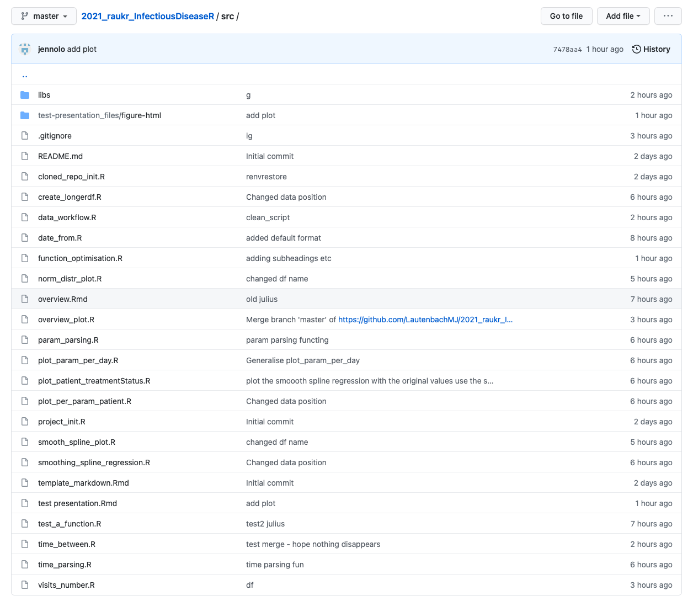

background-image: url(https://upload.wikimedia.org/wikipedia/commons/thumb/0/07/Rauk_faure.jpg/973px-Rauk_faure.jpg)

```{r setup, include=FALSE}
options(htmltools.dir.version = FALSE) 
```

class: center, top, inverse


# Expectations

???

Image credit: [Wikimedia Commons](https://commons.wikimedia.org/wiki/File:Rauk_faure.jpg)

---
background-image: url(https://upload.wikimedia.org/wikipedia/commons/thumb/4/40/Zoom_participants_Bubrikh_readings_2020_conference.png/640px-Zoom_participants_Bubrikh_readings_2020_conference.png)

class: center, bottom, inverse

# Reality

???

Image credit: [Wikimedia Commons](https://commons.wikimedia.org/wiki/File:Zoom_participants_Bubrikh_readings_2020_conference.png)

---
background-image: url(https://upload.wikimedia.org/wikipedia/commons/thumb/4/40/Zoom_participants_Bubrikh_readings_2020_conference.png/640px-Zoom_participants_Bubrikh_readings_2020_conference.png)

class: center, bottom, inverse


# But still a very very good course! :) 

???

Image credit: [Wikimedia Commons](https://commons.wikimedia.org/wiki/File:Zoom_participants_Bubrikh_readings_2020_conference.png)

---

# Project aim

Create package with functions that can 
- Visualize the original data
- Predict viral load values for patients 
- Generate cluster for predicted and existing values
- Visualize the groups
- Write generalized functions

--

## Actual achievements 
- Visualize the original data
- Process the data
- Plot the data
- Write generalized functions
- Create a workflow script using the functions but not a package
- Make a presentation

---

# Work flow


1. Github for the collaboration

2. `renv` for package control

3. `tidyverse` for data preparation

4. `ggplot` for data visualization

5. `tidymodels`/`broom` to predict parameters

6. `roxygen2` when writing functions to prepare for package

6. `rmarkdown`, `xaringan` and `css` for the presentation


---

```{r, message=FALSE, warning=FALSE, echo=FALSE}
source("overview_plot.R")
source("param_parsing.R")
source("time_parsing.R")
source("time_between.R")
source("date_from.R")
source("plot_param_per_day.R")
source("visits_number.R")
source("plot_per_param_patient.R")
source("plot_patient_treatmentStatus.R")
source("create_longerdf.R")
source("norm_distr_plot.R")
source("smoothing_spline_regression.R")
source("smooth_spline_plot.R")
library(tidyverse)
library(magrittr)
```

# Input before preparing the data
```{css,echo=FALSE}
.myclass>pre>code>.remark-code-line{
  font-size: 13px;
  font-style: italic;
  background: #f8f8f8 ;
  border-radius: 2px;
}
```

```{r, echo=FALSE, message=FALSE}
input_data <- read_delim("../data/input_data.csv", delim = ";")
```

.myclass[
```{r, echo=FALSE}
input_data %>% glimpse()
```
]


We have created functions that
1. Calculates number of days between selected columns of class Date
2. Adds column with treatment status
3. Adds column with visit number

---
# Output after data preparation
.myclass[
```{r, message=FALSE, echo=FALSE}
# extract parameter names
param_mapping <- param_parsing(input_data = input_data, input_param1 = "cd4", input_param2 = "cd8", input_param3 = "viral_load")
time_mapping <- time_parsing(input_data = input_data, on_date = "onset_date", vis_date = "visit_date", treat_date = "treatment_date")


## ============ 
## data wrangling
## ============ 
parsed_data <-
  input_data %>% 
  ## transform "_date" columns into date format
  date_from() %>% 
  ## mapping input variable names to function "under-the-hood" variables
  rename(time_mapping) %>% 
  rename(param_mapping) %>%
  ## calculate days between time points
  time_between(names(time_mapping)) %>% 
  ## calculate numbers of visits
  visits_number()

parsed_data  %>% glimpse()
```
]


We have created functions that
1. Calculates number of days between selected columns of class Date 
2. Adds column with treatment status
3. Adds column with visit number

Mainly using the `tidyverse` package


---
#Data overview

```{r, echo=FALSE, warning=FALSE, message=FALSE, dpi=150, out.width = '400px'}
overview_plot(parsed_data = parsed_data, param_mapping = param_mapping)
```

---

# Plot parameters per days and per patient

```{r, echo=FALSE, warning=FALSE, message=FALSE, dpi=150, out.width = '500px'}
plot_param_per_day(parsed_data, y = param1) + labs(col="Patient ID") + xlab("Days post onset") + ylab("CD4 levels")
```


---

# plot with predicted values


---
#Functions and files
.pull-right-30[

]

---

# Challenges

- Working remotely

- Resolving conflicts with Git and GitHub
    - a lot of unmerged files

- CSS formatting of the slide presentation in xaringan

- Packages impossible to install
    - troubles installing kableExtra, unsolvable error

- Time


---
background-image: url(https://upload.wikimedia.org/wikipedia/commons/thumb/7/7b/Seastack_Gotland_Gamle_hamn.jpg/1024px-Seastack_Gotland_Gamle_hamn.jpg)

class: center, bottom, inverse
#Thank you for listening.
#Questions? 


